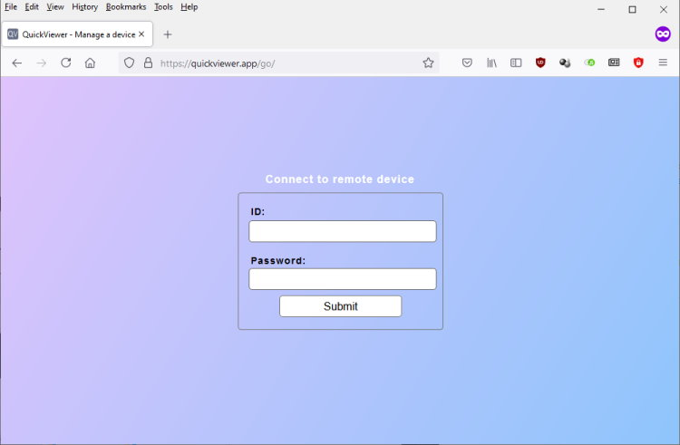
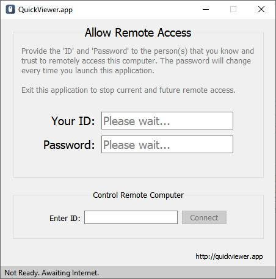

# QuickViewer
**QuickViewer - Remote desktop management from a web browser, based on Qt5 for the desktop host.**

**This project contains three components:**
1. QuickView - Qt client (Windows, Linux) project;
2. quickviewer_proxy - The intermediary proxy server written in Golang
3. public-html - The files that need to be served for the web client portal website.

***Client access portal***



***Host Desktop Qt Application***




***Architecture overview***

```
Web Client <-> HTTP Server (for web UI content)
Web Client <-> Golang WebSocket Server / Proxy <-> QuickViewer Qt application (host desktop)
```

***Credits***
Qt Client based on: https://github.com/agafon0ff/SimpleRemoteDesktop
